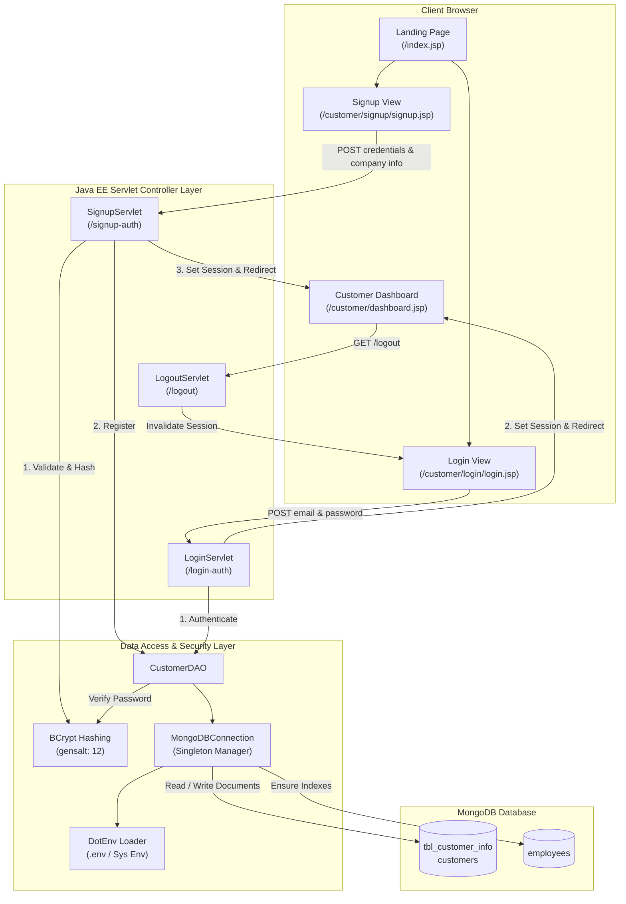
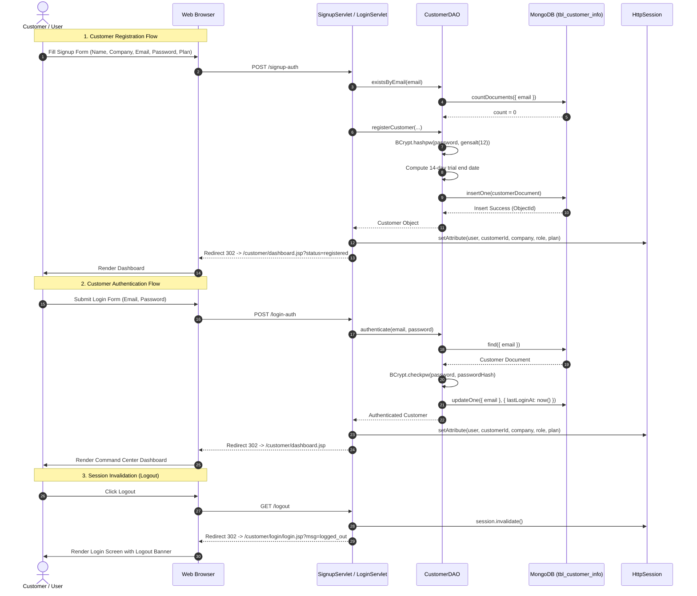

# StockFlow Customer Portal (`stockflow-customer`)

> **Next-Generation Inventory & Warehouse Management System**  
> Enterprise Customer Onboarding, Authentication, and Intelligence Command Center.

---

## 📌 Table of Contents
1. [Overview](#-overview)
2. [Key Capabilities](#-key-capabilities)
3. [Technology Stack](#-technology-stack)
4. [Architecture & Workflow](#-architecture--workflow)
   - [Architectural Overview](#architectural-overview)
   - [Complete End-to-End Workflow](#complete-end-to-end-workflow)
5. [Database Design & Data Model](#-database-design--data-model)
6. [Project Structure](#-project-structure)
7. [Configuration & Environment Variables](#-configuration--environment-variables)
8. [Getting Started & Local Setup](#-getting-started--local-setup)
   - [Prerequisites](#prerequisites)
   - [Building the Application](#building-the-application)
   - [Running Unit Tests](#running-unit-tests)
   - [Deployment](#deployment)
9. [Security Implementation](#-security-implementation)

---

## 📖 Overview

**`stockflow-customer`** is the customer-facing web application module of the **StockFlow** enterprise inventory management platform. It delivers a modern, high-performance web portal enabling B2B clients, warehouse managers, and retail operators to:

* Explore platform capabilities, pricing models, and enterprise logistics solutions.
* Register new customer accounts with an automated **14-day Pro trial** subscription.
* Authenticate securely using salted **BCrypt** password verification backed by **MongoDB**.
* Access a real-time **Enterprise Inventory Command Center** featuring live SKU telemetry, stock valuation, fulfillment KPIs, and automated restock alerts.

---

## 🚀 Key Capabilities

* **Responsive Marketing Landing Page (`/index.jsp`)**:
  * Interactive feature highlights (multi-warehouse visibility, barcode & QR scanning, automated replenishment, AI demand forecasting).
  * Dynamic pricing calculator with annual/monthly billing toggle (20% discount calculation).
  * Live telemetry application preview with turnover trend visualization and SKU movement tables.
  * Customer testimonials, solutions tailored by industry role, and interactive FAQ accordion.

* **Self-Service Customer Registration (`/signup-auth`)**:
  * Form validation, company profile collection, and terms acceptance enforcement.
  * Instant 14-day trial period calculation (`trialStartDate` and `trialEndDate`).
  * Automated document persistence to MongoDB collection `tbl_customer_info`.

* **Secure Authentication & Session Management (`/login-auth`, `/logout`)**:
  * Role-based login handling (`customer` vs `staff`).
  * Database credential lookup with BCrypt password verification.
  * Sandbox demo fallback accounts for offline demonstration.
  * `HttpOnly` session cookie enforcement and 60-minute automatic timeout.

* **Customer Intelligence Command Center (`/customer/dashboard.jsp`)**:
  * Real-time KPI summaries: Total Active SKUs, Stock Valuation, Fulfillment Velocity (99.8%), and Low Stock Warnings.
  * Live SKU Location & Telemetry table displaying bay allocations, available quantities, reorder thresholds, and status flags.
  * Real-time warehouse activity feed (Inbound PO receipts, carrier dispatch notifications, AI auto-replenishments).

---

## 🛠 Technology Stack

| Layer | Technology | Description |
| :--- | :--- | :--- |
| **Language & Platform** | Java 8 (Java EE 8 / Servlet 4.0, JSP 2.3) | Core runtime and web servlet framework |
| **Database** | MongoDB 4.x/5.x/6.x/7.x & Atlas | Document database for customer and operational data |
| **Database Driver** | MongoDB Java Sync Driver (`4.11.1`) | Synchronous Java driver for MongoDB connectivity |
| **Security / Crypto** | jBCrypt (`0.4`) | Salted BCrypt password hashing and verification |
| **Build & Packaging** | Apache Maven (`war` packaging) | Dependency management and build lifecycle |
| **Testing** | JUnit Jupiter (`5.10.2`) | Unit and integration test suite |
| **Frontend / UI** | HTML5, CSS3, Vanilla JavaScript, FontAwesome 6.5 | Dark-mode enterprise UI with Plus Jakarta Sans |

---

## 🔄 Architecture & Workflow

### Architectural Overview



---

### Complete End-to-End Workflow



#### Detailed Lifecycle Steps:

1. **Visitor Discovery (`/index.jsp`)**:
   * The user arrives at the landing page, reviews platform metrics, interactive telemetry preview, client reviews, pricing plans, and FAQs.
   * Clicking **"Start 14-Day Free Trial"** navigates to `/customer/signup/signup.jsp` (pre-selecting the desired subscription plan if query params are present).

2. **Onboarding & Registration (`/signup-auth`)**:
   * Form inputs (`fullName`, `companyName`, `email`, `password`, `confirmPassword`, `plan`, `companySize`, `terms`) are validated by `SignupServlet`.
   * Passwords must be at least 8 characters and match confirmation.
   * `CustomerDAO.existsByEmail()` verifies uniqueness in MongoDB.
   * Passwords are securely hashed with `BCrypt.gensalt(12)`.
   * A 14-day active trial subscription is calculated and attached to the domain model.
   * The customer record is written to MongoDB collection `tbl_customer_info`.
   * An active `HttpSession` is initialized with user metadata and redirected to the dashboard.

3. **Customer & Staff Authentication (`/login-auth`)**:
   * The user supplies credentials and selects a portal role (`customer` or `staff`).
   * `CustomerDAO.authenticate()` searches MongoDB by normalized email, tests the BCrypt hash, and timestamps `lastLoginAt`.
   * If valid, session parameters (`user`, `customerId`, `role`, `company`, `email`, `plan`, `authTime`) are populated.
   * **Demo Fallback**: Supports sandbox evaluation accounts (`alex.morgan@acmelogistics.com` and internal staff accounts) when running disconnected.

4. **Portal Exploration (`/customer/dashboard.jsp`)**:
   * Verifies the active session, escaping all rendered session attributes to prevent XSS.
   * Displays live operational metrics, inventory value, and a real-time SKU bay table.

5. **Session Teardown (`/logout`)**:
   * `LogoutServlet` calls `session.invalidate()` and safely redirects back to `/customer/login/login.jsp?msg=logged_out`.

---

## 🗄 Database Design & Data Model

### Customer Document Schema (`tbl_customer_info`)

```json
{
  "_id": { "$oid": "66db81f21a4e123456789abc" },
  "customerId": "66db81f21a4e123456789abc",
  "fullName": "Jordan Vance",
  "companyName": "Apex Distro LLC",
  "companySize": "21-100",
  "email": "jordan.vance@apexdistro.com",
  "passwordHash": "$2a$12$e8Yx...",
  "role": "customer",
  "subscription": {
    "plan": "pro",
    "status": "trial",
    "trialStartDate": { "$date": "2026-09-06T16:00:00.000Z" },
    "trialEndDate": { "$date": "2026-09-20T16:00:00.000Z" },
    "billingCycle": "monthly"
  },
  "ssoProvider": {
    "provider": "local"
  },
  "termsAccepted": true,
  "termsAcceptedAt": { "$date": "2026-09-06T16:00:00.000Z" },
  "lastLoginAt": { "$date": "2026-09-06T16:05:00.000Z" },
  "createdAt": { "$date": "2026-09-06T16:00:00.000Z" },
  "updatedAt": { "$date": "2026-09-06T16:00:00.000Z" }
}
```

### Auto-Configured MongoDB Indexes
Upon application startup, `MongoDBConnection.ensureIndexes()` automatically establishes unique sparse indexes:
* `tbl_customer_info`: `email` (unique, sparse), `customerId` (unique, sparse)
* `customers`: `email` (unique, sparse), `customerId` (unique, sparse)
* `employees`: `email` (unique, sparse), `employeeId` (unique, sparse)

---

## 📂 Project Structure

```
stockflow-customer/
├── .env                                    # MongoDB connection strings and environment configurations
├── .gitignore                              # Git exclusion rules
├── pom.xml                                 # Maven project descriptor and dependencies
├── mvnw / mvnw.cmd                         # Cross-platform Maven Wrapper executables
├── src/
│   ├── main/
│   │   ├── java/com/inventory/stockflowcustomer/
│   │   │   ├── LoginServlet.java           # Authentication handler for customer & staff logins
│   │   │   ├── LogoutServlet.java          # Session invalidation controller
│   │   │   ├── SignupServlet.java          # Customer registration & trial creation controller
│   │   │   ├── dao/
│   │   │   │   └── CustomerDAO.java        # MongoDB queries, BCrypt auth, and persistence logic
│   │   │   ├── db/
│   │   │   │   └── MongoDBConnection.java  # Singleton client manager, .env parser & index initializer
│   │   │   └── model/
│   │   │       └── Customer.java           # Customer & Subscription domain entity with BSON converters
│   │   ├── resources/
│   │   │   └── META-INF/beans.xml          # CDI configuration descriptor
│   │   └── webapp/
│   │       ├── WEB-INF/
│   │       │   └── web.xml                 # Web application configuration (session timeout, cookies)
│   │       ├── index.jsp                   # StockFlow Marketing & Product Landing Page
│   │       ├── dashboard.jsp               # Root forwarder to /customer/dashboard.jsp
│   │       ├── login.jsp                   # Root forwarder to /customer/login/login.jsp
│   │       ├── signup.jsp                  # Root forwarder to /customer/signup/signup.jsp
│   │       └── customer/
│   │           ├── dashboard.jsp           # Main Customer Command Center Dashboard
│   │           ├── login.jsp               # Login forwarder
│   │           ├── signup.jsp              # Signup forwarder
│   │           ├── css/
│   │           │   ├── login.css           # Styling for login portal
│   │           │   ├── signup.css          # Styling for registration flow
│   │           │   └── style.css           # Global theme, navbar, hero, cards, and dashboard styles
│   │           ├── js/
│   │           │   ├── login.js            # Login client-side validation and role toggles
│   │           │   ├── main.js             # Mobile drawer, FAQ accordion, smooth scrolling
│   │           │   └── signup.js           # Password strength meter and signup validation
│   │           ├── login/
│   │           │   ├── index.jsp           # Login view alias
│   │           │   └── login.jsp           # Customer and staff login page
│   │           └── signup/
│   │               ├── index.jsp           # Signup view alias
│   │               └── signup.jsp          # Customer registration and plan selection view
│   └── test/
│       └── java/com/inventory/stockflowcustomer/
│           ├── CustomerModelTest.java      # Model BSON serialization, equals/hash, and BCrypt tests
│           └── MongoDBConnectionTest.java  # .env configuration resolution tests
```

---

## ⚙ Configuration & Environment Variables

The project dynamically loads configurations with fallback resolution precedence:
1. **Operating System Environment Variables** (`System.getenv`)
2. **Java System Properties** (`System.getProperty`)
3. **Local `.env` File** (resolved from working directory, parent directory, or classpath)

Create a `.env` file in the project root:

```ini
# MongoDB Connection String (Atlas or Local)
MONGODB_URI=mongodb+srv://<username>:<password>@<cluster-url>/?retryWrites=true&w=majority&appName=StockFlowCluster

# Target Database Name
MONGODB_DATABASE=db_stockflow

# Optional Component Credentials (Alternative to full URI)
MONGODB_USER=your_db_user
MONGODB_PASSWORD=your_db_password
MONGODB_HOST=your_db_host
```

---

## 🚀 Getting Started & Local Setup

### Prerequisites
* **Java Development Kit (JDK)**: Version 8 or higher (Java 8 / 11 / 17 / 21)
* **Maven**: Version 3.6+ (or use the included `./mvnw` / `mvnw.cmd`)
* **Servlet Container**: Apache Tomcat 9.x+ or any Java EE 8 / Jakarta EE compatible server
* **MongoDB**: MongoDB Atlas Cluster or local MongoDB instance (v4.4+)

### Building the Application
To compile all classes, run tests, and assemble the deployable `war` archive:

```bash
# On Windows (PowerShell / CMD)
.\mvnw.cmd clean package

# On Linux / macOS
./mvnw clean package
```
The packaged artifact will be generated at:
```
target/stockflowcustomer-1.0-SNAPSHOT.war
```

### Running Unit Tests
Execute the JUnit 5 test suite:

```bash
# On Windows
.\mvnw.cmd test

# On Linux / macOS
./mvnw test
```

### Deployment
1. Copy the generated `target/stockflowcustomer-1.0-SNAPSHOT.war` (or rename to `stockflow-customer.war`) into your Tomcat `webapps/` directory.
2. Ensure your `.env` file exists in the directory where Tomcat is launched, or configure environment variables in your server profile.
3. Start Tomcat:
   ```bash
   # Windows
   catalina.bat run
   # Linux/macOS
   catalina.sh run
   ```
4. Access the application in your browser:
   * **Landing Page**: `http://localhost:8080/stockflowcustomer/`
   * **Customer Login**: `http://localhost:8080/stockflowcustomer/customer/login/login.jsp`
   * **Customer Signup**: `http://localhost:8080/stockflowcustomer/customer/signup/signup.jsp`

---

## 🔒 Security Implementation

* **BCrypt Password Hashing**: Passwords are never stored in plaintext. They are salted and hashed with `BCrypt.gensalt(12)` prior to database persistence.
* **Input Sanitization & Output Escaping**: Server-side validation on email patterns, password constraints, and HTML entity escaping on JSPs to mitigate XSS risks.
* **Secure Session Cookies**: `web.xml` enforces `<http-only>true</http-only>` to protect session IDs from JavaScript interception.
* **Session Expiry**: Inactive sessions automatically expire after 60 minutes.
* **Unique Constraints**: MongoDB unique indexes on `email` and `customerId` prevent duplicate account creation and race conditions.
